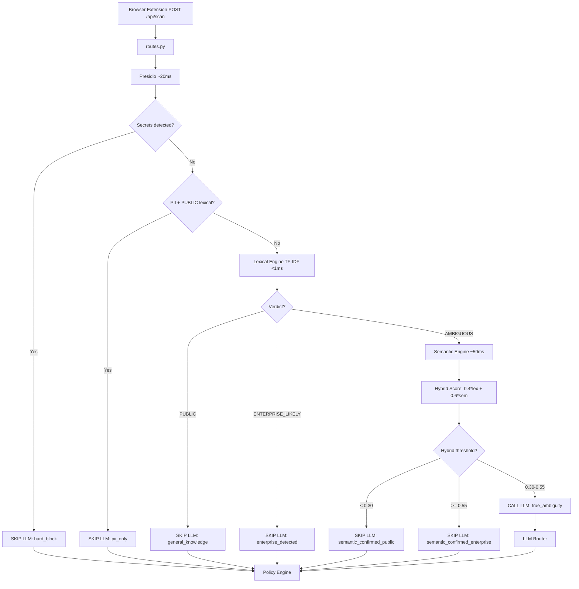
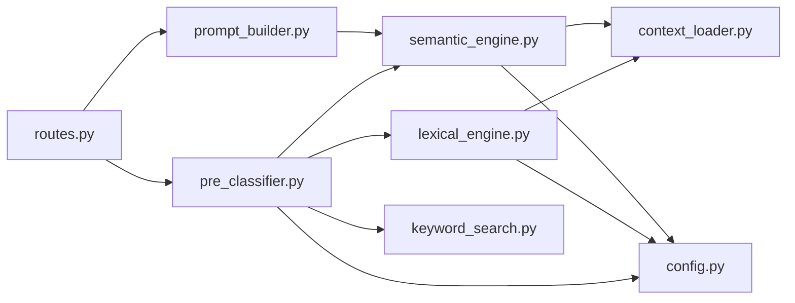

# Design Document: Lexical + Semantic Retrieval Upgrade

## Overview

This design replaces the naive keyword-overlap scoring in `keyword_search.py` with a two-layer retrieval system combining TF-IDF lexical scoring and FAISS semantic vector search. The system introduces a three-tier routing decision in the Pre-Classifier that eliminates unnecessary LLM calls by resolving most prompts deterministically through term weighting (lexical) and synonym/paraphrase detection (semantic).

The architecture follows a cascading precision model: the fast lexical engine handles the majority of cases (PUBLIC and ENTERPRISE_LIKELY verdicts), semantic search only activates for the ambiguous middle tier, and the LLM is reserved for true ambiguity (estimated ~5% of requests). This reduces LLM call rate from ~60% to under 10% while maintaining sub-1% false negative rates.

**Key Design Principles:**
- Local-only processing: no external API calls for scoring (embedding model runs on CPU)
- Graceful degradation: if engines fail to load, the system continues with reduced functionality
- Zero-downtime rollback: a single environment variable reverts to legacy behavior
- Configuration-driven: all thresholds tunable without code changes

## Architecture



### Module Dependency Graph



### Startup Sequence

1. `context_loader.py` loads all knowledge base Markdown files into memory (existing behavior)
2. `lexical_engine.py` builds inverted index from loaded documents (<2s for up to 5000 docs)
3. `semantic_engine.py` loads/builds FAISS index:
   - If persisted index exists and file mtimes match: load from disk (~200ms)
   - Otherwise: chunk docs → embed with MiniLM → build FAISS index → persist to disk

## Components and Interfaces

### 1. Lexical Engine (`backend/ai/lexical_engine.py`)

**Responsibility:** Build an in-memory inverted index at startup and score prompts using TF-IDF.

```python
class LexicalEngine:
    """TF-IDF scoring engine with inverted index."""

    def __init__(self, documents: list[dict], config: LexicalConfig):
        """
        Build inverted index from knowledge base documents.

        Args:
            documents: List of dicts from context_loader (keys: path, filename, category, content)
            config: Configuration object with thresholds
        """
        ...

    def score(self, prompt: str) -> LexicalResult:
        """
        Score a prompt against the inverted index using TF-IDF.

        Args:
            prompt: Raw user prompt text

        Returns:
            LexicalResult with tfidf_score, verdict, top_docs, matched_terms
        """
        ...

    def _tokenize(self, text: str) -> list[str]:
        """Tokenize text into lowercase alphanumeric tokens (min 2 chars)."""
        ...

    def _build_index(self, documents: list[dict]) -> None:
        """Build inverted index: token -> list[(doc_id, tf)] + df count."""
        ...
```

**Output interface:**

```python
@dataclass
class LexicalConfig:
    public_threshold: float = 0.15
    enterprise_threshold: float = 0.45
    high_df_cutoff: float = 0.60  # tokens in >60% docs get near-zero IDF

@dataclass
class LexicalResult:
    tfidf_score: float          # Normalized 0.0-1.0
    verdict: str                # "PUBLIC" | "AMBIGUOUS" | "ENTERPRISE_LIKELY"
    top_docs: list[dict]        # Top matching documents with scores
    matched_terms: list[str]    # Terms that contributed to the score
```

**Algorithm:**

1. Tokenize prompt: regex `[a-zA-Z][a-zA-Z0-9_-]+`, lowercase, filter len > 2
2. For each prompt token found in the inverted index:
   - Look up document frequency `df(t)`
   - Compute `idf(t) = log(N / df(t))` where N = total docs
   - If `df(t) / N > 0.60`: assign `idf(t) ≈ 0` (near-zero weight for generic terms)
   - Accumulate `score += tf(t, prompt) * idf(t)`
3. Normalize score to 0.0–1.0 range (divide by max possible score for prompt length)
4. Apply verdict thresholds

### 2. Semantic Engine (`backend/ai/semantic_engine.py`)

**Responsibility:** Embed knowledge chunks using a local sentence-transformer model and perform FAISS similarity search.

```python
class SemanticEngine:
    """Sentence-transformer embeddings + FAISS vector search."""

    def __init__(self, documents: list[dict], config: SemanticConfig):
        """
        Load or build FAISS index from knowledge base documents.

        Args:
            documents: List of dicts from context_loader
            config: Configuration with model name, chunk size, index path
        """
        ...

    def search(self, prompt: str, top_k: int = 3) -> SemanticResult:
        """
        Embed prompt and search FAISS index for similar chunks.

        Args:
            prompt: Raw user prompt text
            top_k: Number of top chunks to return

        Returns:
            SemanticResult with semantic_score, top_chunks, source_docs
        """
        ...

    def _chunk_documents(self, documents: list[dict]) -> list[dict]:
        """Split documents into chunks by heading boundaries or ~500 chars."""
        ...

    def _build_index(self, chunks: list[dict]) -> None:
        """Embed all chunks and build FAISS IndexFlatIP."""
        ...

    def _load_persisted_index(self) -> bool:
        """Load index from disk if mtimes match. Returns True if successful."""
        ...

    def _persist_index(self) -> None:
        """Save FAISS index and chunk metadata to disk."""
        ...
```

**Output interface:**

```python
@dataclass
class SemanticConfig:
    model_name: str = "all-MiniLM-L6-v2"
    chunk_size: int = 500
    index_dir: str = "backend/ai/index"

@dataclass
class SemanticResult:
    semantic_score: float       # 0.0-1.0 (max similarity from top-k)
    top_chunks: list[dict]      # [{text, source_doc, score}, ...]
    source_docs: list[str]      # Unique source document filenames
```

**Chunking Strategy:**

1. Split on Markdown `##` headings first (preserves logical sections)
2. If a section exceeds `chunk_size` chars, split further at paragraph boundaries
3. Each chunk retains metadata: `{text, source_filename, category, heading}`

**Index Persistence:**

- Files stored in `backend/ai/index/`:
  - `faiss.index`: serialized FAISS IndexFlatIP
  - `chunks.json`: chunk metadata (text, source, category)
  - `mtimes.json`: file modification times at index build time
- On startup: compare current file mtimes against `mtimes.json`
  - Match → load from disk (fast path)
  - Mismatch → rebuild index (slow path, only on knowledge base changes)

### 3. Updated Pre-Classifier (`backend/ai/pre_classifier.py`)

**Changes:** Replace PATH 4 (general_knowledge) and PATH 5 (enterprise_ambiguous) with three-tier lexical+semantic routing. Add legacy fallback toggle.

```python
def pre_classify(prompt: str, masked_text: str, presidio_result: dict) -> dict:
    """
    Updated return dict adds:
        "lexical_result": LexicalResult | None
        "semantic_result": SemanticResult | None
        "hybrid_score": float | None
    """
    ...
```

**New decision paths:**
- `general_knowledge`: Lexical verdict = PUBLIC, no PII
- `enterprise_detected`: Lexical verdict = ENTERPRISE_LIKELY
- `semantic_confirmed_public`: Hybrid < 0.30
- `semantic_confirmed_enterprise`: Hybrid >= 0.55
- `true_ambiguity`: Hybrid 0.30–0.55 → LLM needed

### 4. Updated Prompt Builder (`backend/ai/prompt_builder.py`)

**Changes:** Accept optional `semantic_chunks` parameter. When available, include chunks (~500 chars each) alongside or instead of full documents to reduce token usage.

```python
def build_prompt(
    masked_text: str,
    retrieved_docs: list[dict] | None = None,
    semantic_chunks: list[dict] | None = None,
) -> dict:
    """
    Returns {"system": "...", "user": "..."} for LLM call.

    When semantic_chunks is provided, formats them as targeted context
    instead of/alongside full documents. Falls back to full documents
    if no chunks available.
    """
    ...
```

### 5. Configuration (`backend/config.py`)

**New settings added to the existing dotenv pattern:**

```python
# Lexical Engine
TFIDF_PUBLIC_THRESHOLD = float(os.environ.get("PROMPTSHIELD_TFIDF_PUBLIC_THRESHOLD", "0.15"))
TFIDF_ENTERPRISE_THRESHOLD = float(os.environ.get("PROMPTSHIELD_TFIDF_ENTERPRISE_THRESHOLD", "0.45"))

# Semantic Engine
EMBEDDING_MODEL = os.environ.get("PROMPTSHIELD_EMBEDDING_MODEL", "all-MiniLM-L6-v2")
SEMANTIC_CHUNK_SIZE = int(os.environ.get("PROMPTSHIELD_SEMANTIC_CHUNK_SIZE", "500"))

# Hybrid Scoring
HYBRID_LEXICAL_WEIGHT = float(os.environ.get("PROMPTSHIELD_HYBRID_LEXICAL_WEIGHT", "0.4"))
HYBRID_SEMANTIC_WEIGHT = float(os.environ.get("PROMPTSHIELD_HYBRID_SEMANTIC_WEIGHT", "0.6"))
HYBRID_PUBLIC_THRESHOLD = float(os.environ.get("PROMPTSHIELD_HYBRID_PUBLIC_THRESHOLD", "0.30"))
HYBRID_ENTERPRISE_THRESHOLD = float(os.environ.get("PROMPTSHIELD_HYBRID_ENTERPRISE_THRESHOLD", "0.55"))

# Legacy fallback
USE_LEGACY_SEARCH = os.environ.get("PROMPTSHIELD_USE_LEGACY_SEARCH", "false").lower() == "true"
```

## Data Models

### Inverted Index Structure

```python
# In-memory structure (not persisted — rebuilt from context_loader on startup)
inverted_index: dict[str, dict] = {
    "mercury": {
        "df": 2,                              # document frequency
        "postings": [(0, 3), (15, 1)],        # (doc_id, term_frequency)
    },
    "payment": {
        "df": 5,
        "postings": [(0, 7), (3, 2), (8, 1), (15, 4), (22, 1)],
    },
    "service": {
        "df": 38,                             # >60% of 47 docs → near-zero IDF
        "postings": [...],
    },
}

# Metadata
idf_cache: dict[str, float] = {
    "mercury": 3.16,    # log(47/2) = high weight (rare term)
    "payment": 2.24,    # log(47/5) = medium weight
    "service": 0.01,    # near-zero (generic term)
}
```

### FAISS Index Persistence Format

```python
# backend/ai/index/chunks.json
{
    "chunks": [
        {
            "id": 0,
            "text": "## OAuth2 Implementation\n\nThe Orion identity service...",
            "source_filename": "Identity-api.md",
            "category": "apis",
            "heading": "OAuth2 Implementation"
        },
        ...
    ],
    "metadata": {
        "model_name": "all-MiniLM-L6-v2",
        "embedding_dim": 384,
        "num_chunks": 142,
        "built_at": "2026-07-15T10:30:00Z"
    }
}

# backend/ai/index/mtimes.json
{
    "knowledge/apis/Identity-api.md": 1752595200.0,
    "knowledge/apis/payment-api.md": 1752595200.0,
    ...
}

# backend/ai/index/faiss.index — binary FAISS serialized file
```

### Pre-Classifier Result (Updated Schema)

```python
{
    "needs_llm": False,
    "reason": "Enterprise context detected via TF-IDF (score=0.52)",
    "decision_path": "enterprise_detected",
    "pre_eci": { ... },             # Pre-built ECI when LLM skipped
    "knowledge_hits": [...],        # Legacy format for backward compat
    "lexical_result": {             # NEW
        "tfidf_score": 0.52,
        "verdict": "ENTERPRISE_LIKELY",
        "top_docs": [...],
        "matched_terms": ["oauth2", "implementation", "orion"]
    },
    "semantic_result": None,        # NEW (None when not invoked)
    "hybrid_score": None            # NEW (None when not computed)
}
```

## Correctness Properties

*A property is a characteristic or behavior that should hold true across all valid executions of a system—essentially, a formal statement about what the system should do. Properties serve as the bridge between human-readable specifications and machine-verifiable correctness guarantees.*

### Property 1: IDF Correctness with High-Frequency Dampening

*For any* corpus of documents and *for any* token present in the corpus, the computed IDF weight SHALL equal `log(N / df(t))` when the token appears in 60% or fewer of the documents, and SHALL be near-zero (< 0.01) when the token appears in more than 60% of documents.

**Validates: Requirements 1.2, 1.3**

### Property 2: TF-IDF Score Bounds Invariant

*For any* prompt string and *for any* knowledge base corpus, the TF-IDF score returned by the Lexical Engine SHALL be a float in the range [0.0, 1.0] inclusive.

**Validates: Requirements 2.1**

### Property 3: Lexical Verdict Threshold Consistency

*For any* prompt and corpus, the verdict returned by the Lexical Engine SHALL be exactly:
- `PUBLIC` when `tfidf_score < public_threshold`
- `AMBIGUOUS` when `public_threshold <= tfidf_score < enterprise_threshold`
- `ENTERPRISE_LIKELY` when `tfidf_score >= enterprise_threshold`

These three cases are mutually exclusive and exhaustive for all scores in [0.0, 1.0].

**Validates: Requirements 2.2, 2.3, 2.4**

### Property 4: Document Chunking Size Bounds

*For any* Markdown document, every chunk produced by the Semantic Engine's chunking function SHALL have a length of at most `2 * chunk_size` characters, and the concatenation of all chunks (ignoring heading splits) SHALL preserve all non-whitespace content from the original document.

**Validates: Requirements 3.4**

### Property 5: Semantic Search Score Bounds and Ordering

*For any* prompt and *for any* FAISS index of embedded chunks, the semantic similarity score returned by the Semantic Engine SHALL be in [0.0, 1.0], and the returned top-k chunks SHALL be sorted by descending similarity score.

**Validates: Requirements 4.1, 4.2**

### Property 6: Pre-Classifier Priority Routing

*For any* prompt, masked text, and Presidio result:
- If secrets are detected, the decision path SHALL be `hard_block` regardless of PII or lexical/semantic signals
- If PII is detected with a PUBLIC lexical verdict (no secrets), the decision path SHALL be `pii_only`
- If the lexical verdict is PUBLIC with no PII and no secrets, the decision path SHALL be `general_knowledge`
- If the lexical verdict is ENTERPRISE_LIKELY (no secrets), the decision path SHALL be `enterprise_detected`
- If the lexical verdict is AMBIGUOUS (no secrets, no PII-only shortcut), the semantic engine SHALL be invoked

This priority ordering ensures secrets always take precedence over all other signals.

**Validates: Requirements 5.1, 5.2, 5.3, 5.4, 5.5**

### Property 7: Hybrid Score Formula Correctness

*For any* pair of TF-IDF score and semantic similarity score (both in [0.0, 1.0]), the hybrid score SHALL equal `lexical_weight * tfidf_score + semantic_weight * semantic_score` where weights are the configured values (default 0.4 and 0.6 respectively).

**Validates: Requirements 6.1**

### Property 8: Hybrid Routing Threshold Consistency

*For any* computed hybrid score:
- If `hybrid_score < public_threshold` (default 0.30), the routing decision SHALL be `semantic_confirmed_public` with `needs_llm=False`
- If `hybrid_score >= enterprise_threshold` (default 0.55), the routing decision SHALL be `semantic_confirmed_enterprise` with `needs_llm=False`
- If `public_threshold <= hybrid_score < enterprise_threshold`, the routing decision SHALL be `true_ambiguity` with `needs_llm=True`

These three cases are mutually exclusive and exhaustive.

**Validates: Requirements 6.2, 6.3, 6.4**

### Property 9: Prompt Builder Context Inclusion

*For any* call to `build_prompt`:
- When `semantic_chunks` is provided and non-empty, the user prompt output SHALL contain the text of each provided chunk
- When `semantic_chunks` is None or empty and `retrieved_docs` is provided, the user prompt output SHALL contain the content of the retrieved documents
- In all cases, the output dict SHALL contain both `"system"` and `"user"` keys with non-empty string values

**Validates: Requirements 7.1, 7.2, 7.3**

## Error Handling

### Graceful Degradation Strategy

The system follows a "degrade, don't crash" principle at every layer:

| Failure | Degraded Behavior | User Impact |
|---------|-------------------|-------------|
| Lexical Engine fails to build index | Fall back to legacy `keyword_search.py` | Slightly higher false-positive rate |
| Semantic Engine fails to load model | Skip semantic layer; use lexical-only verdicts (AMBIGUOUS → LLM call) | More LLM calls for ambiguous prompts |
| FAISS index corrupted on disk | Delete index files, rebuild from scratch | One-time startup delay |
| Both engines fail | Continue with no search scoring; all non-trivial prompts → LLM | Reverts to pre-upgrade behavior |
| `sentence-transformers` not installed | Semantic Engine reports unavailable; lexical-only mode | No semantic understanding |

### Error Handling by Component

**Lexical Engine:**
- If `context_loader.load_knowledge_base()` returns empty: log warning, return score=0.0, verdict=PUBLIC for all prompts
- If tokenization produces empty token list: return score=0.0, verdict=PUBLIC
- Division by zero in IDF (df=0): should never occur (only tokens in the index are scored), but guard with max(df, 1)

**Semantic Engine:**
- Model download failure on first run: log error, mark engine as unavailable, do not block startup
- FAISS search on empty index: return semantic_score=0.0, empty chunks
- Embedding timeout/crash: catch exception, return degraded result, log for monitoring
- Corrupted `faiss.index` file: delete and rebuild on next startup

**Pre-Classifier:**
- Lexical engine unavailable + legacy disabled: skip keyword scoring, send all non-trivial prompts to LLM
- Semantic engine unavailable: treat AMBIGUOUS verdict as → LLM (same as if hybrid couldn't be computed)
- Both unavailable: revert to original pre_classifier behavior (PII/secrets/trivial checks only)

**Configuration:**
- Invalid threshold values (e.g., public_threshold > enterprise_threshold): log error, use defaults
- Missing env vars: always have sensible defaults (already part of the config.py pattern)

## Testing Strategy

### Property-Based Testing

This feature is well-suited for property-based testing because the core logic consists of pure functions (tokenization, TF-IDF scoring, threshold routing, hybrid computation, chunking) with clear input/output behavior and universal invariants.

**Library:** [Hypothesis](https://hypothesis.readthedocs.io/) (Python PBT framework)

**Configuration:**
- Minimum 100 iterations per property test (Hypothesis default: 100 examples)
- Settings: `@settings(max_examples=200, deadline=None)` for tests involving model inference
- Each test tagged with: `# Feature: lexical-semantic-upgrade, Property {N}: {title}`

**Property tests to implement (one per correctness property):**

| Test | Property | Generators |
|------|----------|------------|
| `test_idf_correctness` | Property 1 | Random corpora (1-100 docs), random token distributions |
| `test_tfidf_score_bounds` | Property 2 | Random prompts (arbitrary strings), random document sets |
| `test_verdict_threshold_consistency` | Property 3 | Random scores in [0.0, 1.0], random threshold pairs |
| `test_chunking_bounds` | Property 4 | Random markdown documents with headings |
| `test_semantic_score_bounds_ordering` | Property 5 | Random prompts against a test FAISS index |
| `test_preclassifier_priority_routing` | Property 6 | Random combinations of (secrets, PII, lexical_verdict) |
| `test_hybrid_formula` | Property 7 | Random float pairs in [0.0, 1.0] |
| `test_hybrid_routing_thresholds` | Property 8 | Random hybrid scores in [0.0, 1.0] |
| `test_prompt_builder_context` | Property 9 | Random chunk lists, random doc lists |

### Unit Tests (Example-Based)

- Configuration loading: verify env vars override defaults, verify dotenv integration
- Legacy fallback toggle: verify switching between engines
- Startup behavior: verify index persistence load/rebuild logic
- Edge cases:
  - Empty prompt → score 0.0, verdict PUBLIC
  - Prompt with only stopwords → score 0.0
  - Single-character tokens → filtered out
  - Knowledge base with 0 documents → graceful handling
  - All documents identical → all tokens get near-zero IDF

### Integration Tests

- End-to-end `/api/scan` with labeled prompt suite (30+ cases from spec Section 9)
- Verify decision paths: trivial → general_knowledge → enterprise_detected → semantic paths
- Verify legacy fallback produces backward-compatible results
- Verify FAISS index persistence: build, restart, verify loaded from disk
- Verify model download behavior on fresh environment

### Performance Tests

- Lexical engine scoring latency (< 1ms for 5000 docs)
- Semantic engine search latency (< 50ms for 5000 chunks)
- Full pipeline latency (non-LLM path < 200ms)
- Index build time (< 2s for 5000 docs)

### Test File Structure

```
tests/
├── test_lexical_engine.py          # Unit + property tests for TF-IDF
├── test_semantic_engine.py         # Unit + property tests for embeddings/FAISS
├── test_pre_classifier_routing.py  # Property tests for routing logic
├── test_prompt_builder.py          # Property tests for context assembly
├── test_hybrid_scoring.py          # Property tests for hybrid formula
├── test_routing_decisions.py       # Integration tests (labeled prompt suite)
└── conftest.py                     # Shared fixtures, test corpora generators
```

